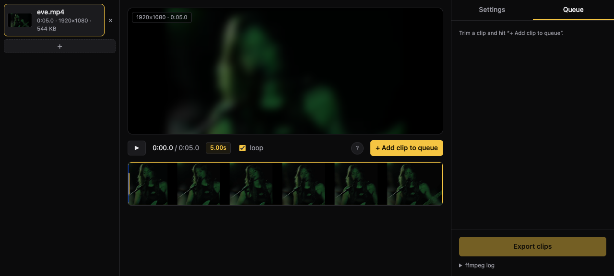
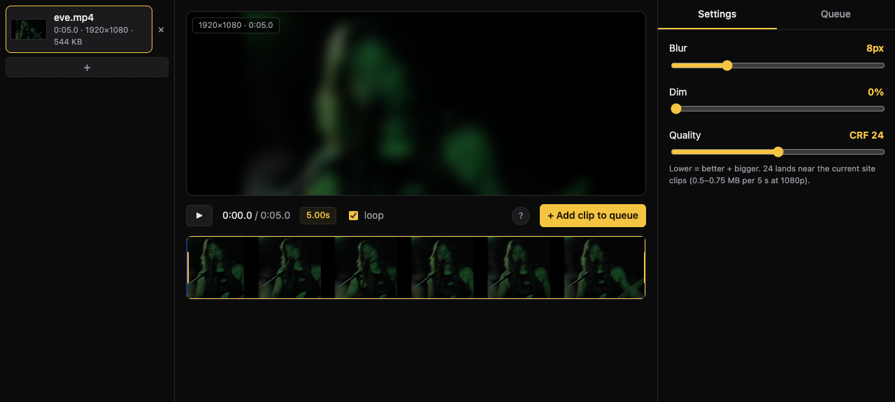

# Shoegaze

Turn raw band footage into short, hazy, pre-blurred clips for website
backgrounds. Drop in footage, trim out the good moments, bake in the blur, and
export small web-ready H.264 files — entirely in the browser.

Named for the genre: dreamy, blurred, and always looking down at the pedals.



## Why

Blurring video in the browser costs CPU on every visitor's machine, on every
page load. It is far cheaper to blur the clips once, at export time, and serve
the result. Shoegaze does that one job well: it takes the video files straight
off a camera or phone and produces the finished loops, so publishing a new
background clip is a two-minute job.

The blur and the dim are baked into the exported files. What the website adds
at runtime is only a little extra push-back where the text needs it.

## Features

- **Drag-and-drop footage** — several files at once; each one is probed for
  duration, size, and a thumbnail.
- **Filmstrip timeline** — real frames on the strip. Drag the yellow handles
  to trim, scrub anywhere, loop the selection to check the cut.
- **Many clips per source** — trim, add to the queue, trim again.
- **Live preview** — the preview applies the exact same blur and dim that the
  export will bake in. What you see is what ships.
- **Web-ready exports** — H.264, yuv420p, `faststart`, no audio, capped at
  1080p, sized like the clips already on the site (about 0.5–0.75 MB per 5 s).
- **No install, no server** — the whole tool is a static page. The ffmpeg.wasm
  core is served locally, so it works offline, and no footage ever leaves the
  machine.

## Getting started

You need Node.js. Then:

```sh
npm install
npm run dev
```

`npm install` copies the ffmpeg.wasm core (about 30 MB) from node_modules into
`public/`. After that the tool works fully offline.

## Usage

### Trim

Drop footage onto the page, then drag the yellow handles on the filmstrip to
set the in and out points. Park the playhead somewhere and press `I` or `O` to
cut there instead. Loop the selection to watch the cut over and over.

| Key | Action |
| --- | --- |
| `space` | Play / pause |
| `I` / `O` | Set in / out at the playhead |
| `←` / `→` | Nudge the playhead 0.1 s (`shift` = 1 s) |
| `L` | Loop over the selection |

Happy with the cut? **+ Add clip to queue**. One source can give any number of
clips — trim again and add more.

### Export

The right sidebar has two tabs. **Settings** holds the sliders; **Queue** holds
the clips waiting for export, the export button, and the ffmpeg log.



- **Blur** — gaussian σ baked into the file. 8 matches the site's CSS
  `blur(8px)`.
- **Dim** — a black scrim, baked in. The site adds its own scrim per page, so
  this normally stays at 0.
- **Quality (CRF)** — lower is better and bigger. 24 lands near the current
  clips.

**Export** runs the queue; each finished clip shows its size with a download
link. **Save all** writes every finished clip into a folder you pick — point it
at the website's `src/lib/assets/videos/` and the new clips join the rotation
straight away.

## How it works

The tool runs [ffmpeg.wasm](https://ffmpegwasm.netlify.app/) in a web worker.
For each clip it runs:

```
ffmpeg -ss <start> -i input -t <duration> \
  -vf "scale=<w>:<h>,gblur=sigma=<blur>,colorchannelmixer=rr=<1-dim>:gg=<1-dim>:bb=<1-dim>" \
  -c:v libx264 -preset veryfast -crf <crf> -pix_fmt yuv420p \
  -movflags +faststart -an -dn output.mp4
```

The two effect filters mirror the website's CSS exactly:

- CSS `blur(N px)` is a gaussian with standard deviation N, so the preview
  applies `filter: blur(N px)` and the export applies `gblur=sigma=N`.
- A black scrim at opacity d scales every channel by (1 − d), which is what
  `colorchannelmixer` does.

Sources are written into the wasm filesystem once and reused for all their
clips, then deleted. Encoded results come back as blobs for download.

## Limitations

- Encoding runs in WebAssembly: allow roughly 10–40 s per 5-second clip.
- The wasm heap is 32-bit, so source files over about 1.5 GB may fail to load.
- If the browser cannot decode a file (some phone HEVC, for example), the tool
  cannot load it either.
